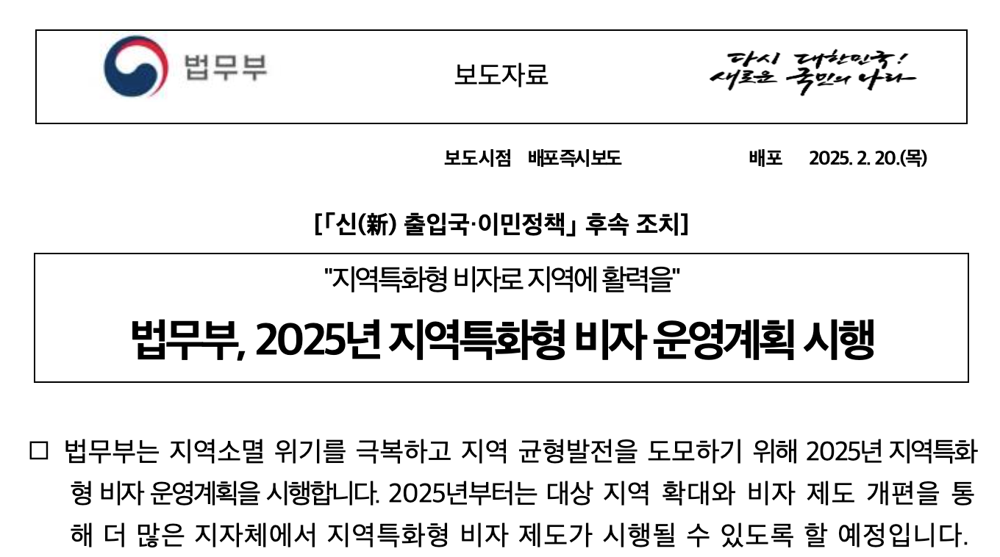
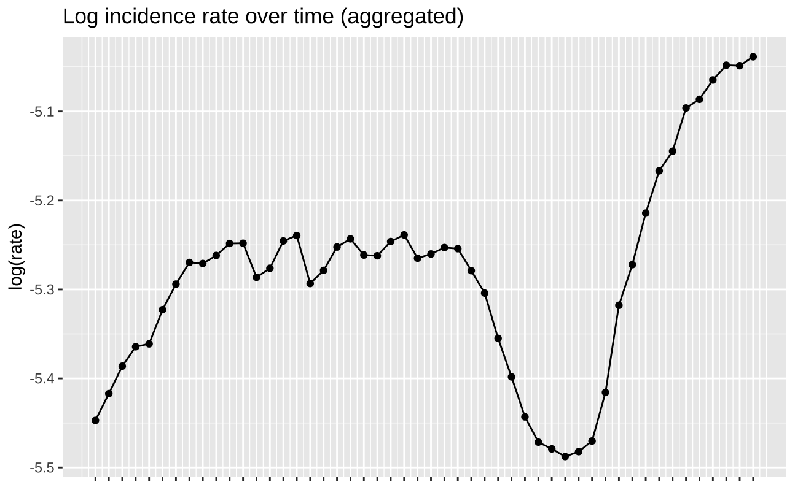
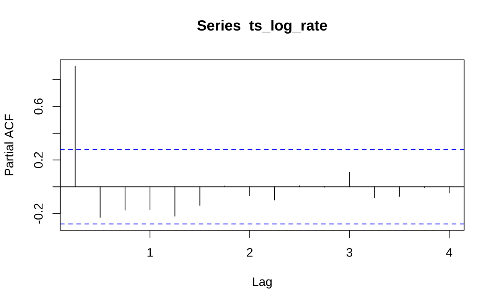
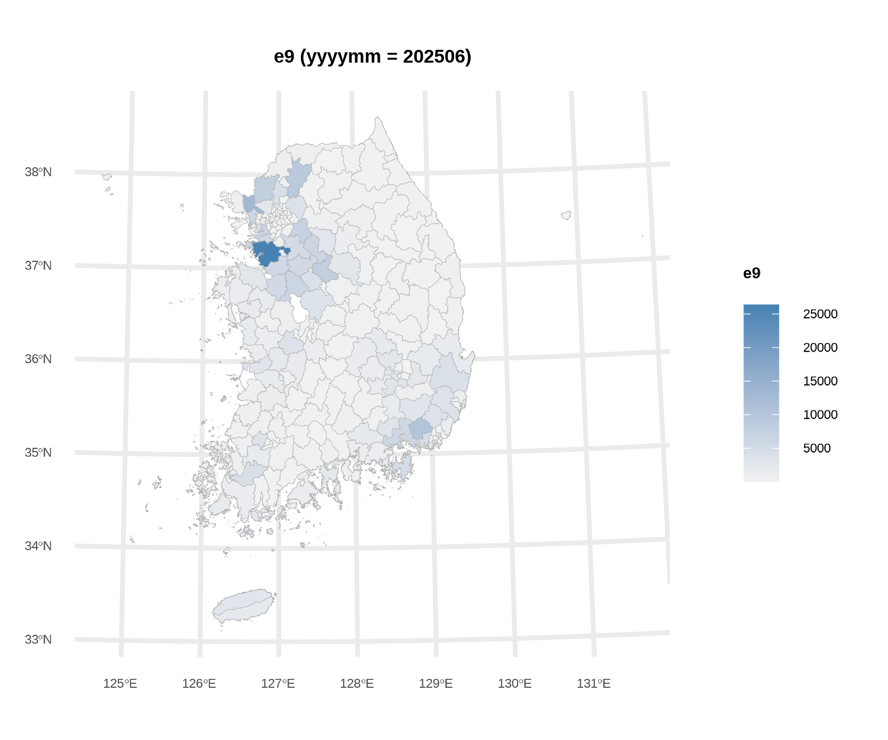
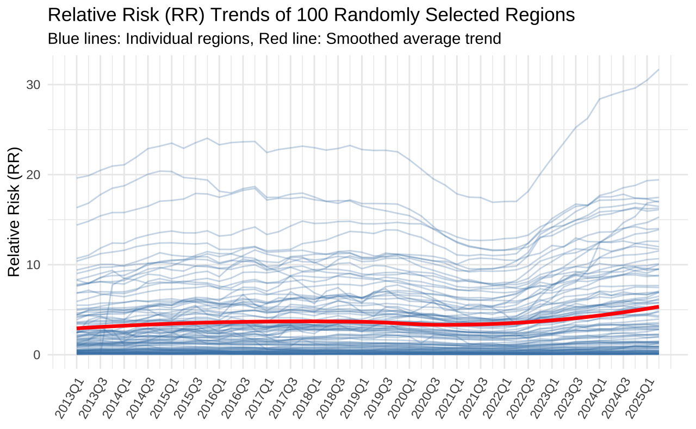
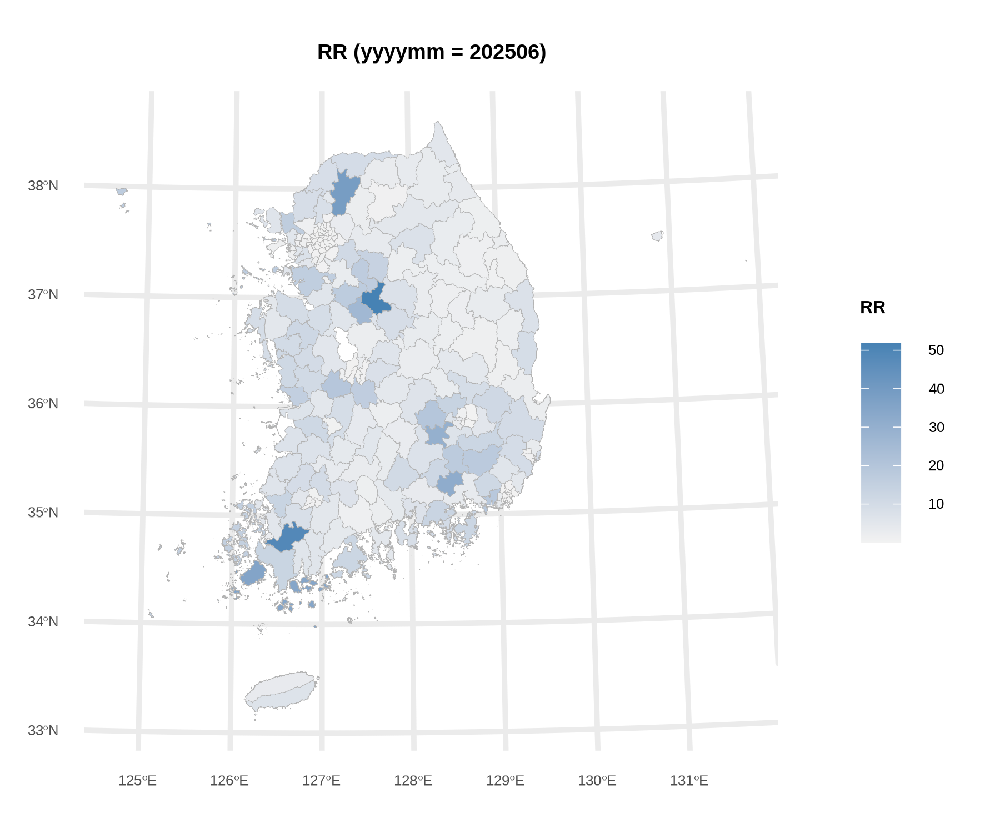
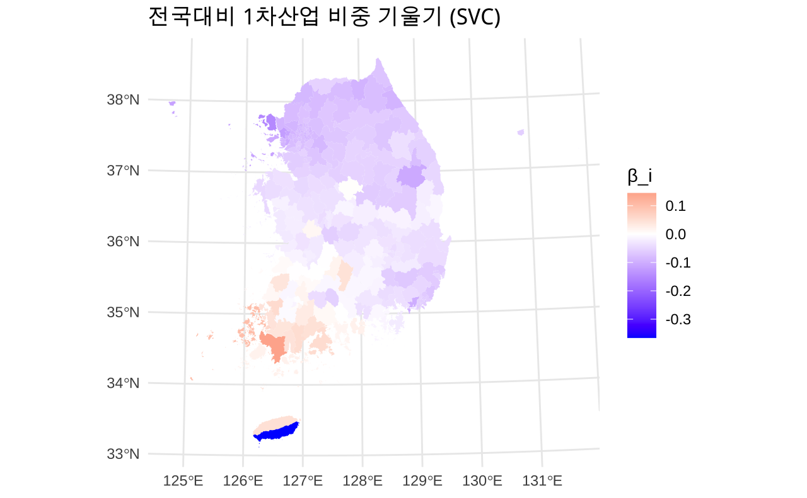
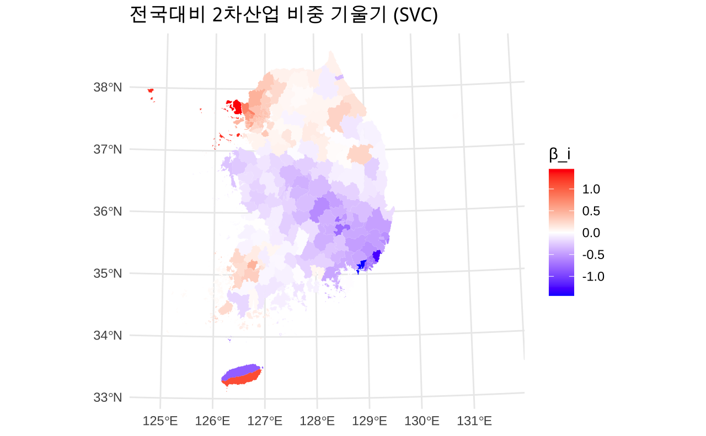

# 1. 연구 배경 및 목적

## 연구 배경

::: incremental
-   E-9(비전문취업) 비자

    -   국내 외국인 체류자격 중 가장 높은 비중 차지 (약 33만 명)

    -   i.e. "고용허가제": 비숙련, 저임금 노동자의 수급이 어려운 중소 사업장을 대상으로 함

    -   세부자격: 제조업(E9-1), 건설업(E9-2), 농업(E9-3), ...

<!-- -->

-   인구 감소 및 고령화 위기 → 단순 노동 분야 외국인력 수급의 중요성 ↑

    -   공간적 문제: **인구구조 변동에 따른 지역 격차의 다층성**

        -   비수도권과 수도권 간 인력난 격차

        -   지역특화형 비자 등 지역별 정책 시행 기조
:::

. . .

::::: columns
::: {.column width="50%"}

:::

::: {.column width="50%"}
<!-- 시계열 그래프 삽입 -->


:::
:::::

------------------------------------------------------------------------

## 연구 배경

-   문제 상황:

    -   지자체별 특성에 맞는 등록외국인 관리 전략 마련 필요

    -   **시군구 단위의 실증적 데이터와 분석**이 부족


## 연구 목적

::: {.fragment fragment-index="1"}
-   시군구별 E-9 비자 등록인원 (stock) 변동 요인 규명
    -   **2013\~2025년 시공간-패널 자료**를 이용한 시공간 분석
    -   시공간 베이지안 계층 모형의 활용
:::

:::: {.fragment fragment-index="2"}
::: callout-note
#### 핵심 연구 질문 (RQ)

1.  시공간 베이지안 계층 모형의 **설명력**은 어느 정도인가?
2.  어떤 **지역별/산업별 요인**이 (세부자격별) E-9 비자 등록인원 분포에 유의한 영향을 미치는가?
    -   (인구) **성비**(남초)가 높을수록, **고령층 비율**이 높을수록, **인구 유출**이 높을수록 E-9 발생률이 높을 것이다.

    -   (거시경제) 경기 상황을 나타내는 **무역수지** 등과 E-9 발생률 간에는 관계가 적을 것이다.

    -   (산업) **제조업 비중**이 높은 시군구일수록 E-9 발생률이 높을 것이다.

    -   (지역) 비수도권에 비해 **수도권** 지역의 E-9 발생률이 높을 것이다.
3.  (**인구 구조의 역동성**에 따라 향후 E-9 비자 등록인원 공간 분포는 어떻게 변화하는가?)
:::
::::

# 2. 데이터 구축

## 분석 기간 및 대상

-   **기간**: 2013년 1분기 \~ 2025년 2분기 (총 13개년, 50개 분기)

. . .

-   **공간**: 전국 **228개 시군구** (비자치구 통합, 세종시 제외)
    -   총 관측지: 228 × 50 = **11,400개 패널 관측지**
    -   세부자격별(제조업, 건설업, 농업, 어업, 임업, ...) E-9 데이터도 구득 가능

. . .

-   **출처**
    -   법무부 통계월보
    -   통계청 인구동향조사, 지역별 고용조사, ...
    -   MDIS 직종별사업체노동력조사 등 기타 통계 자료

## 주요 공변량 목록

| 구분 | 변수명 | 시공간 해상도 |
|-------------------|-----------------------------|------------------------|
| 인구 구조 | 성비, 연령층별 인구, MEI 등 | 시군구 × 분기 |
| 경제 | 수출입액, 무역수지, 경제활동인구 | 시군구 × 분기/반기 |
| 산업 구조 | 산업별 종사자 수 비중, GRDP 비중 | 시군구 × 반기/년 |
| 더미 | 수도권/비수도권, 시/군/구, 코로나19, 산업단지 유무 | 시군구 × 분기 |
| 기타 (시도 수준) | 부족인원, 제조업생산지수 등 | 시도 × 분기/년 |

. . .

::: callout-important
**주요 난점 1**

-   분석 기간 내 행정구역 변동 → (1) matching table 구성 (2) 최신 행정구역을 기준으로 병합/연결 진행

    -   명칭 변동: 당진, 여주, 포천, 인천 남구 등

    -   행정구역 통합: 청주-청원, 마산-진해-창원

-   데이터 원천별 코드 불일치 (행정구역, 산업, ...) → 코드 연계표 활용
:::

## 주요 공변량 목록

| 구분 | 변수명 | 시공간 해상도 |
|-------------------|-----------------------------|------------------------|
| 인구 구조 | 성비, 연령층별 인구, MEI 등 | 시군구 × 분기 |
| 경제 | 수출입액, 무역수지, 경제활동인구 | 시군구 × 분기/반기 |
| 산업 구조 | 산업별 종사자 수 비중, GRDP 비중 | 시군구 × 반기/년 |
| 더미 | 수도권/비수도권, 시/군/구, 코로나19, 산업단지 유무 | 시군구 × 분기 |
| 기타 (시도 수준) | 부족인원, 제조업생산지수 등 | 시도 × 분기/년 |

::: callout-important
**주요 난점 2**

-   필요한 데이터를 구득하기 어려운 경우

    -   시도-수준 혹은 연-수준으로만 구득 가능한 경우

    -   e.g. MDIS 데이터 (사업체별 부족인원 수)

-   데이터에 결측치가 존재하는 경우

    -   e.g. GRDP (\~2022년)
:::

# 3. 연구 방법론

## 시공간 베이지안 계층 모형 (Spatio-Temporal Bayesian Hierarchical Model)

-   (Data Level) 종속변수 $y_{i,t}$ (E9 등록인원)가 포아송 분포를 따른다고 가정:

$$
y_{i,t} \mid \lambda_{i,t} \sim \text{Poisson}(E_{i,t}\lambda_{i,t})
$$

-   (Process Level) 로그 선형 모형:

$$
\log \lambda_{i,t} = \alpha + x_{i,t}'\beta + u_{i,t} + \eta_t 
$$

-   (Hyperparameter Level) Latent Spatio-Temporal Field

$$
\begin{align}
u_{i,t} = \rho_u u_{i, t-1} + \epsilon_{i, t} \\
\epsilon_{i,t} \sim \text{BYM2}(W, \tau_u, \phi), \\ \eta_t \sim \text{AR(1)}(\rho_\eta, \tau_\eta)
\end{align}
$$

-   Priors: $\tau_n, \phi, \tau_\eta, \rho_u, \rho_\eta$

-   사후분포:

$$
\pi(\mathbf{x}, {\theta} \mid \mathbf{y}) \propto \underbrace{\pi(\mathbf{y} \mid \mathbf{x}, {\theta})}_{\text{Likelihood}} \times \underbrace{\pi(\mathbf{x} \mid {\theta})}_{\text{Latent Field}} \times \underbrace{\pi({\theta})}_{\text{Hyperpriors}}
$$

## 시공간 베이지안 계층 모형 (Spatio-Temporal Bayesian Hierarchical Model)

-   해석 방법:

    -   $E_{i, t}$(offset) 설정에 따른 $\lambda_{i,t}$(rate)해석의 차이: $E(y_{i,t} ) = E_{i,t} \times \lambda_{i,t}$

        -   **인구 수**: "지역 내 E-9 외국인 근로자가 얼마나 많은가?"

        -   ✅ **전체 종사자 수**: "지역 노동력 중 E-9 외국인 근로자가 차지하는 비중은 얼마인가?"

    -   $\beta$의 해석: 승법적 효과 (Multiplicative Effect)

        -   로그 연결 함수를 이용

        -   변수 $x$가 1단위 증가할 때, 유입률(Rate)는 $\exp(\beta)$배 증가

. . .

-   사후분포의 추정: INLA

    -   **I**ntegrated **N**ested **L**aplace **A**pproximations

        -   MCMC 대비 연산 속도가 빠름 (복잡한 시공간 모형에서 널리 활용)

        -   R의 `INLA` 패키지 이용

## 시공간 베이지안 계층 모형 (Spatio-Temporal Bayesian Hierarchical Model)

무엇이 "시공간적"인가?

$$
\log \lambda_{i,t} = \alpha + x_{i,t}'\beta + u_{i,t} + \eta_t 
$$

. . .

-   $u_{i,t}$: **시공간 랜덤 효과 (Random Effects)**
    -   BYM2 공간 구조 $\times$ AR(1) 시간 구조
    -   $u_{i,t} = \rho u_{i,t-1} + \epsilon_{i,t}$
        -   $\epsilon_{i,t} \sim \text{BYM2}(W, \tau_u, \phi)$ (공간적 자기상관 반영)

. . .

-   $\eta_{t(i)}$: **전역적 시간/공간 추세 (Global Trend)**

. . .

-   $x_{i,t}\beta$**: 고정 효과 (Fixed Effects)**
    -   인구, 경제 지표 등 설명변수
    -   Spatially Varing Coefficient (SVC): $\beta(s_i) = \beta + b_i$


# 4. 탐색적 데이터 분석 (EDA)

------------------------------------------------------------------------

::::: columns
### 시계열 추세

::: {.column width="50%"}
-   2013년 이후 **완만한 증가**
-   **코로나19 시기(2020\~2022)** 일시적 감소
-   2022년 이후 **회복**
-   ACF/PACF 분석 결과\
    → **AR(1) 과정**이 지배적인 패턴
:::

::: {.column width="50%"}
<!-- 시계열 그래프 삽입 -->




:::
:::::

------------------------------------------------------------------------

::::: columns
### 공간적 분포

::: {.column width="50%"}
-   **수도권**, **충남**, **호남/영남 산업단지** 중심으로\
    E-9 외국인 근로자 고밀도 분포
-   Moran's I 검정 결과
    -   유의한 **양의 공간적 자기상관** 확인
:::

::: {.column width="50%"}
<!-- 공간 분포 지도 삽입 -->



<!-- {width=100%} -->
:::
:::::

------------------------------------------------------------------------

::::: columns
### 공간적 분포

::: {.column width="50%"}
-   (총인구 기준) RR 상위 5개 시군구 (202506):\
    음성군, 포천시, 영암군, 완도군, 고령군


:::

::: {.column width="50%"}
<!-- 공간 분포 지도 삽입 -->



<!-- {width=100%} -->
:::
:::::

# 5. 모형 비교

## WAIC 기반 분기별 모형 비교

시공간 상호작용을 고려한 모형의 **설명력이 가장 우수함**.

| Model             | 특징                             | WAIC   | 비고           |
|------------------|-------------------|------------------|------------------|
| (1), (2) Temporal | RW1 / AR1                        | 12.1억 | 설명력 낮음    |
| \(3\) Covariates  | 공변량 추가                      | 8.6억  | 일부 개선      |
| \(4\) Additive    | 공간 + 시간 (additive)           | 392만  | 대폭 개선      |
| \(5\) Interaction | 공간 × 시간 상호작용 (BYM2\*AR1) | 10.1만 | **Best Model** |
| \(6\) Full Model  | 상호작용 + 공변량                | 10.1만 | (5)와 유사     |

## **해석**

-   단순히 시계열 구조만 넣은 모형 (1), 공변량만 추가한 모형 (3)에 비해
-   **지역 간 인접성(BYM2)**과 **시간적 흐름(AR1)**을 함께 반영한 **시공간 랜덤효과 모형 (5)**이 E-9 외국인 분포에 대한 설명력이 뛰어남.
-   공변량을 추가한 모형 (6)의 설명력이 크게 개선되지는 않음. (오히려 복잡도 증가로 WAIC 증가)

# 6. 변수 선택

## 전체 고정 효과(Fixed Effects) 추정 결과 {.smaller .scrollable}

```{=html}
<style>
/* 표의 글씨를 강제로 더 줄이고 싶다면 이 스타일을 사용하세요 */
.reveal table {
  font-size: 0.6em; 
}
</style>
```

| 구분 | 변수명 | Mean | SD | 95% CI | Sig |
|:-----------|:-----------|:----------:|:----------:|:----------:|:----------:|
| **Constant** | **(Intercept)** | **-7.051** | **1.135** | **\[-9.274, -4.820\]** | **Yes** |
| **Demographic** | 성비 | 0.012 | 0.011 | \[-0.009, 0.034\] |  |
|  | 65세 이상 인구 비율 | 0.000 | 0.000 | \[0.000, 0.000\] |  |
|  | 인구 이동 유효도 지수 | 0.004 | 0.008 | \[-0.011, 0.019\] |  |
| **Economy** | **무역수지** | **-0.041** | **0.021** | **\[-0.082, -0.001\]** | **Yes** |
|  | 전국대비 1차산업 GRDP 비중 | 0.044 | 0.037 | \[-0.029, 0.117\] |  |
|  | 전국대비 2차산업 GRDP 비중 | 0.045 | 0.046 | \[-0.045, 0.135\] |  |
| **Industry** | **제조업 종사자 비율 (Z)** | **0.721** | **0.077** | **\[0.569, 0.872\]** | **Yes** |
|  | 건설업 종사자 비율 (Z) | 0.011 | 0.026 | \[-0.040, 0.062\] |  |
|  | 도소매업 종사자 비율 (Z) | 0.044 | 0.045 | \[-0.045, 0.132\] |  |
| **Labor** | **고용률 (15-64) (Z)** | **-0.134** | **0.027** | **\[-0.187, -0.081\]** | **Yes** |
| **Context** | 코로나 시기 | 0.422 | 0.216 | \[-0.128, 0.795\] |  |
| **Region** | 수도권 여부 | 0.263 | 0.337 | \[-0.400, 0.922\] |  |
|  | 시 지역 (군 대비) | -0.012 | 0.155 | \[-0.318, 0.292\] |  |
|  | **구 지역 (군 대비)** | **-2.598** | **0.224** | **\[-3.037, -2.158\]** | **Yes** |
| **Infra** | **산업단지 유무** | **0.814** | **0.199** | **\[0.426, 1.206\]** | **Yes** |
|  | 산업단지 면적 (Z) | -0.038 | 0.065 | \[-0.165, 0.090\] |  |

: {.striped .hover}

## 유입 요인 (Pull Factors)

::: incremental
-   **제조업 비중 (`ind_ratio_manufacturing_z`)**
    -   $\beta = 0.721$
    -   제조업 비중이 **1 표준편차(SD) 증가**할 때, 외국인력 유입은 약 **2.06배** 증가\
        ($\exp(0.721) \approx 2.056$)
    -   해석: 지역 내 제조업 기반이 E-9 인력 수요의 절대적인 결정 요인
-   **산업단지 유무 (`indpark_dummy`)**
    -   $\beta = 0.814$
    -   산업단지가 **있는 지역**은 없는 지역 대비 약 **2.26배** 더 많은 외국인력이 유입됨\
        ($\exp(0.814) \approx 2.257$)
    -   단순 면적(`area_mgmt`)은 크게 상관이 없었음
:::

## 억제 및 대체 요인 (Push & Substitution)

::: panel-tabset
### 지역적 특성

-   **구(Gu) 지역 더미 (`dummy_gu`)**
    -   $\beta = -2.598$ (매우 강력한 음의 효과)
    -   \~군 지역 대비, 대도시 자치구 지역의 외국인력은 **약 7.4% 수준**에 불과\
        ($\exp(-2.598) \approx 0.074$)
    -   해석: E-9 비자의 특성상 주거 중심의 대도시(구)보다는 농공단지/산업단지가 위치한 군 단위 지역에 집중됨

### 노동시장 특성

-   **내국인 고용률 (`lf_employment_rate`)**
    -   $\beta = -0.134$
    -   고용률이 **1 SD 증가**하면 외국인력은 약 **12.5% 감소**\
        ($\exp(-0.134) \approx 0.875$).
    -   해석: 내국인 고용 사정이 좋은 지역일수록 비전문 외국인력에 대한 의존도가 낮음. 반대로, **내국인 고용률이 낮은 지역에서 외국인력 수요가 증가**하는 대체 관계가 확인
:::

# 7. 확장된 모형들

## E9-1(제조업) 등록인원 발생률

| 구분 | 변수명 | Mean | SD | 95% CI | Sig |
|:-----------|:-----------|:----------:|:----------:|:----------:|:----------:|
| **Constant** | **(Intercept)** | **-7.499** | **0.306** | **\[-8.087, -6.909\]** | **Yes** |
| **Demographic** | 성비 (Z) | 0.056 | 0.067 | \[-0.075, 0.187\] |  |
|  | **65세 이상 인구 (Z)** | **-0.278** | **0.076** | **\[-0.428, -0.130\]** | **Yes** |
|  | 인구이동지표 (Z) | 0.002 | 0.008 | \[-0.013, 0.018\] |  |
| **Economy** | **무역수지 (Z)** | **-0.047** | **0.020** | **\[-0.087, -0.007\]** | **Yes** |
|  | 1차산업 GRDP 편차 (Z) | -0.009 | 0.038 | \[-0.084, 0.065\] |  |
|  | 2차산업 GRDP 편차 (Z) | 0.044 | 0.046 | \[-0.047, 0.134\] |  |
| **Industry** | **제조업 비율 (Z)** | **0.977** | **0.083** | **\[0.813, 1.139\]** | **Yes** |
|  | 건설업 비율 (Z) | 0.020 | 0.027 | \[-0.033, 0.072\] |  |
|  | 도소매업 비율 (Z) | 0.027 | 0.047 | \[-0.065, 0.119\] |  |
| **Labor** | **고용률 (15-64) (Z)** | **-0.150** | **0.027** | **\[-0.202, -0.097\]** | **Yes** |
| **Context** | 코로나 시기 | 0.421 | 0.203 | \[-0.046, 0.798\] |  |
| **Region** | 수도권 여부 | 0.473 | 0.385 | \[-0.284, 1.228\] |  |
|  | 시 지역 (군 대비) | 0.231 | 0.173 | \[-0.109, 0.570\] |  |
|  | **구 지역 (군 대비)** | **-2.479** | **0.253** | **\[-2.974, -1.983\]** | **Yes** |
| **Infra** | **산업단지 유무** | **1.188** | **0.230** | **\[0.738, 1.642\]** | **Yes** |
|  | 산단 관리면적 (Z) | -0.014 | 0.073 | \[-0.157, 0.131\] |  |

-   `pop_65plus` ($\beta \approx -0.28$): 고령화가 심한 지역일수록 제조업 기반이 약화되어 외국인력 수요가 낮게 나타남
-   `trade_balance` ($\beta \approx -0.05$): 무역수지가 악화될수록(적자) 비전문 외국인력 의존도가 높아지는 경향

## E9-3(농업) 등록인원 발생률

```{=html}
<style>
.reveal table {
  font-size: 0.55em; 
}
</style>
```

| 구분 | 변수명 | Mean | SD | 95% CI | Sig |
|:-----------|:-----------|:----------:|:----------:|:----------:|:----------:|
| **Constant** | (Intercept) | -1.455 | 1.184 | \[-3.778, 0.869\] |  |
| **Demographic** | 성비 | -0.004 | 0.010 | \[-0.024, 0.015\] |  |
|  | 65세 이상 인구 비율 | 0.000 | 0.000 | \[0.000, 0.000\] |  |
|  | **인구이동유효도지수 (Z)** | **0.015** | **0.006** | **\[0.003, 0.027\]** | **Yes** |
| **Economy** | 무역수지 (Z) | -0.026 | 0.019 | \[-0.063, 0.011\] |  |
|  | 1차산업 GRDP 편차 (Z) | -0.045 | 0.031 | \[-0.106, 0.015\] |  |
|  | 2차산업 GRDP 편차 (Z) | -0.064 | 0.043 | \[-0.148, 0.021\] |  |
| **Industry** | **제조업 비율 (Z)** | **0.330** | **0.082** | **\[0.170, 0.490\]** | **Yes** |
|  | 건설업 비율 (Z) | 0.026 | 0.020 | \[-0.014, 0.066\] |  |
|  | 도소매업 비율 (Z) | 0.059 | 0.040 | \[-0.020, 0.138\] |  |
| **Labor** | **고용률 (15-64) (Z)** | **-0.076** | **0.021** | **\[-0.117, -0.035\]** | **Yes** |
| **Context** | 코로나 시기 | 0.055 | 0.183 | \[-0.294, 0.439\] |  |
| **Region** | 수도권 여부 | 0.326 | 0.691 | \[-1.029, 1.681\] |  |
|  | 시 지역 (군 대비) | -0.407 | 0.308 | \[-1.013, 0.196\] |  |
|  | **구 지역 (군 대비)** | **-6.328** | **0.451** | **\[-7.216, -5.446\]** | **Yes** |
| **Infra** | **산업단지 유무** | **2.071** | **0.433** | **\[1.227, 2.926\]** | **Yes** |
|  | 산단 관리면적 (Z) | -0.092 | 0.131 | \[-0.349, 0.165\] |  |

: {.striped .hover}

-   `dummy_gu` ($\beta \approx -6.3$): 대도시 자치구 지역은 E9-3 수요가 사실상 0에 수렴

-   `indpark` ($\beta \approx 2.1$): 순수 경작지보다 **농공단지**가 결합된 지역에서 인력 수요 급증

## SVC(Spatially Varing Coefficient)[^1]

[^1]: E9(전체) 발생률(rate)

::::: columns
::: {.column width="50%"}
-   전국대비 1차산업 비중 (기존: $\hat\beta =  0.044$)



-   전국적으로 영향이 미미하나, 전남 등 농업 중심 지자체에서 핵심 동인으로 작용
:::

::: {.column width="50%"}
-   전국대비 2차산업 비중 (기존: $\hat\beta =  0.045$)



-   수도권 대비 충청권, 영남권에서 2차산업 비중의 영향력이 낮음
:::
:::::

# 8. 결론

## 고용허가제 외국인 근로자 패널 자료 분석

1.  **패널 데이터의 구조적 특성 확인**

-   E-9 등록외국인 데이터는 무작위 분포가 아닌, **강한 공간적 자기상관**과 **시계열적 의존성,** 둘 간의 상호작용에 의한 의존성을 내포하고 있음

-   '독립성 가정'이 위배됨 → 시공간적 의존성을 제외한 결정 요인의 영향력 분석할 필요 있음

. . .

2.  **시공간 베이지안 계층 모형**

-   기존의 선형 회귀나 단순 패널 모형은 시공간적 상호작용을 설명하는 데 한계가 있음

-   시공간 베이지안 모형은 고정효과와 랜덤효과를 계층적으로 분리하여 이를 효과적으로 모델링

-   SVC, 세부자격별 모형, 다른 공분산 구조 등으로 확장 가능함

. . .

$\implies$ 시군구별 산업 특성과 인구 구조를 반영한 정밀한 지역 맞춤형 외국인력 정책 수립의 실증적 근거

## 추가 연구

1.  **변수 확장**
    -   시군구 단위의 정밀 변수 추가
        -   순이동, 성비, 연령구조 세분화
    -   정책적/환경적 요인 추가
        -   이주민 커뮤니티, 주거 환경 등
    -   시간 지연 효과 고려: 전기(前期) 변수 이용
    -   시도 단위 변수 이용

. . .

2.  **Spatial Confounding**[^2]**인가?**
    -   RSR (Restricted Spatial Regression)
    -   Spatial+ 기법 적용 검토

[^2]: 설명변수와 공간 오차항의 작동 스케일이 같을 때 공선성 문제가 발생하는 것 (Paciorek, 2010)

# Q & A

감사합니다.